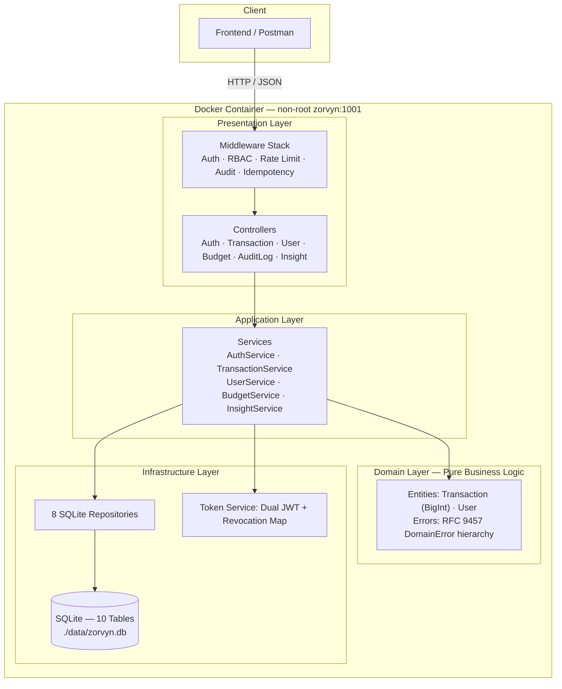

<div align="center">

# 🏦 Zorvynnn

**High-Integrity Financial Dashboard Backend**

A production-ready REST API built with Clean Architecture, featuring RBAC, BigInt-precision currency, idempotent writes, time-series analytics, and Docker deployment.


</div>

---

## ✨ Feature Highlights

| Category | Features |
|---|---|
| **Security** | Dual-token JWT (access + refresh), HttpOnly cookies, bcrypt hashing, rate limiting, token revocation |
| **RBAC** | 5-table schema (Users, Roles, Permissions, User↔Roles, Role↔Permissions). Viewer / Analyst / Admin |
| **Financial Precision** | BigInt cents storage — zero floating-point contamination. API returns dollar strings |
| **Analytics** | SUM/CASE WHEN aggregation, category breakdown, monthly trend bucketing for line charts |
| **Resilience** | Idempotent POST requests via `Idempotency-Key` header with 24h expiry |
| **Budgeting** | Monthly budgets per category with real-time remaining calculation |
| **Data Portability** | Stream-based CSV export (constant memory for 10K+ records) |
| **AI Intelligence** | Rule-based spending analysis engine generating prioritized, actionable financial tips |
| **Compliance** | Immutable audit logs (INSERT-only), soft deletes, RFC 9457 error responses |
| **DevOps** | Multi-stage Dockerfile (non-root), docker-compose, GitHub Actions CI |
| **Documentation** | Auto-generated Swagger/OpenAPI at `/api-docs`, Postman collection included |

---

## 🏗️ Architecture



> **Dependencies point inward only.** The Domain layer has zero external dependencies. Services contain zero SQL and zero HTTP concepts.

---

## 🔌 API Reference (27 Endpoints)

### Authentication
| Method | Endpoint | Auth | Description |
|---|---|---|---|
| `POST` | `/api/v1/auth/register` | Public | Create account |
| `POST` | `/api/v1/auth/login` | Public | Get tokens (rate limited) |
| `POST` | `/api/v1/auth/refresh` | Cookie | Refresh access token |
| `POST` | `/api/v1/auth/logout` | Bearer | Revoke tokens |

### Transactions
| Method | Endpoint | Permission | Description |
|---|---|---|---|
| `GET` | `/api/v1/transactions` | `read_transactions` | List with filters + cursor pagination |
| `GET` | `/api/v1/transactions/export` | `read_transactions` | CSV download (streamed) |
| `GET` | `/api/v1/transactions/:id` | `read_transactions` | Get single record |
| `POST` | `/api/v1/transactions` | `create_transaction` | Create (supports idempotency) |
| `PUT` | `/api/v1/transactions/:id` | `update_transaction` | Update record |
| `DELETE` | `/api/v1/transactions/:id` | `delete_transaction` | Soft delete |

### Analytics
| Method | Endpoint | Permission | Description |
|---|---|---|---|
| `GET` | `/api/v1/analytics/summary` | `read_analytics` | Income/expense/net totals |
| `GET` | `/api/v1/analytics/categories` | `read_analytics` | Category breakdown |
| `GET` | `/api/v1/analytics/trends` | `read_analytics` | Monthly trends (12-month array) |
| `GET` | `/api/v1/analytics/ai-insights` | `read_analytics` | AI-powered financial tips |

### Budgets
| Method | Endpoint | Permission | Description |
|---|---|---|---|
| `POST` | `/api/v1/budgets` | `create_transaction` | Set/update monthly budget |
| `GET` | `/api/v1/budgets` | `read_transactions` | List with remaining amounts |
| `DELETE` | `/api/v1/budgets/:id` | `create_transaction` | Remove budget |

### Administration
| Method | Endpoint | Permission | Description |
|---|---|---|---|
| `GET` | `/api/v1/users` | `manage_users` | List all users |
| `GET` | `/api/v1/users/:id` | `manage_users` | Get user details |
| `POST` | `/api/v1/users/:id/roles` | `manage_users` | Assign role |
| `DELETE` | `/api/v1/users/:id/roles/:roleName` | `manage_users` | Remove role |
| `POST` | `/api/v1/users/:id/deactivate` | `manage_users` | Deactivate + revoke tokens |
| `POST` | `/api/v1/users/:id/activate` | `manage_users` | Reactivate account |
| `GET` | `/api/v1/audit-logs` | `manage_users` | Query audit trail |

### Infrastructure
| Method | Endpoint | Auth | Description |
|---|---|---|---|
| `GET` | `/api/v1/health` | Public | Health check |
| `GET` | `/api-docs` | Public | Swagger UI |

---

## 🚀 Quick Start

### Docker (Recommended)

```bash
# Clone and start
git clone https://github.com/your-username/zorvyn.git
cd zorvyn

# Start with docker-compose
docker compose up -d

# Verify
curl http://localhost:3000/api/v1/health
# → { "status": "ok", "timestamp": "2026-..." }

# View API documentation
open http://localhost:3000/api-docs

# Stop
docker compose down
```

### Local Development

```bash
# Install dependencies
npm install

# Create environment file
cp .env.example .env

# Start dev server (with hot reload)
npm run dev

# Run tests
npm test

# Run migrations manually
npm run migrate
```

### Environment Variables

| Variable | Default | Description |
|---|---|---|
| `PORT` | `3000` | Server port |
| `NODE_ENV` | `development` | Environment |
| `DB_PATH` | `./data/zorvyn.db` | SQLite database path |
| `ACCESS_TOKEN_SECRET` | `dev-access-secret` | JWT access token secret |
| `REFRESH_TOKEN_SECRET` | `dev-refresh-secret` | JWT refresh token secret |
| `ACCESS_TOKEN_EXPIRY` | `15m` | Access token TTL |
| `REFRESH_TOKEN_EXPIRY` | `7d` | Refresh token TTL |

---

## 🧪 Test Suite

```
 ✓ tests/unit/domain/User.test.js              (10)
 ✓ tests/unit/domain/Transaction.test.js        (31)
 ✓ tests/unit/security/tokenService.test.js      (7)
 ✓ tests/unit/services/AuthService.test.js       (8)
 ✓ tests/integration/auth.test.js                (8)
 ✓ tests/integration/rbac.test.js               (18)
 ✓ tests/integration/transactions.test.js       (14)
 ✓ tests/integration/analytics.test.js           (7)
 ✓ tests/integration/users.test.js              (11)
 ✓ tests/integration/rateLimit.test.js           (2)
 ✓ tests/integration/infrastructure.test.js      (4)
 ✓ tests/integration/idempotency.test.js         (5)
 ✓ tests/integration/trends.test.js              (6)
 ✓ tests/integration/queryOptimization.test.js   (3)
 ✓ tests/integration/budgets.test.js             (6)
 ✓ tests/integration/export.test.js              (4)
 ✓ tests/integration/auditLogs.test.js           (3)
 ✓ tests/integration/aiInsights.test.js          (9)
 ✓ tests/performance/load.test.js                (3)

 Test Files  19 passed (19)
      Tests  159 passed (159)
```

**Performance:** All queries complete under 100ms with 1,000 records, including 10 concurrent requests.

---

## 📁 Project Structure

```
zorvyn/
├── src/
│   ├── domain/              # Pure business logic (zero dependencies)
│   │   ├── entities/        # Transaction.js, User.js
│   │   └── errors/          # DomainError.js (RFC 9457)
│   ├── application/         # Use-case orchestration
│   │   └── services/        # Auth, Transaction, User, Budget, Insight
│   ├── infrastructure/      # External concerns
│   │   ├── database/        # connection, migrator, 10 migrations
│   │   ├── repositories/    # 8 SQLite repositories
│   │   └── security/        # tokenService (dual JWT + revocation)
│   ├── presentation/        # HTTP interface
│   │   ├── controllers/     # Auth, Transaction, User, Budget, AuditLog, Insight
│   │   ├── routes/          # 27 endpoints
│   │   ├── middleware/      # auth, RBAC, audit, rate limit, idempotency
│   │   └── validators/      # Input validation
│   └── config/              # App config, Swagger spec
├── tests/
│   ├── unit/                # Domain entity + service tests
│   ├── integration/         # Full API endpoint tests
│   └── performance/         # Load benchmarks
├── Dockerfile               # Multi-stage, non-root (alpine)
├── docker-compose.yml       # Orchestration with SQLite volume
├── .github/workflows/ci.yml # GitHub Actions pipeline
├── DEPLOY.md                # Render + Fly.io deployment guide
└── ARCHITECTURAL_DECISIONS.md
```

---

## 📊 Database Schema

10 sequential migrations producing 10 tables:

| # | Table | Purpose |
|---|---|---|
| 001 | `users` | User accounts (soft-delete) |
| 002 | `roles` | Role definitions (Viewer, Analyst, Admin) |
| 003 | `permissions` | Granular permission atoms |
| 004 | `user_roles` | User ↔ Role junction |
| 005 | `role_permissions` | Role ↔ Permission junction |
| 006 | *(seed)* | Default roles, permissions, and mappings |
| 007 | `transactions` | Financial records (BIGINT cents, 5 indexes) |
| 008 | `audit_logs` | Immutable compliance trail |
| 009 | `idempotent_requests` | Idempotency cache (24h expiry) |
| 010 | `budgets` | Monthly budget limits per category |

---

## 🛡️ High-Integrity Features

These features demonstrate engineering rigor aligned with financial compliance standards:

### BigInt Precision Storage
All monetary values stored as `INTEGER` (cents) — `$150.75` becomes `15075`. Zero floating-point contamination across all arithmetic, aggregation, and reporting. The API boundary handles `dollar string ↔ cents` conversion via `Transaction.dollarsToCents()` and `Transaction.centsToDollars()`, ensuring no float ever touches the database.

### 5-Table RBAC Hierarchy
Users, Roles, Permissions, User↔Roles, and Role↔Permissions form a many-to-many authorization model enforced at every endpoint via middleware. The Principle of Least Privilege (PoLP) is verified across 18 RBAC integration tests. Deactivating a user instantly revokes all JWT tokens — no 15-minute vulnerability window.

### Idempotent Financial Writes
The `Idempotency-Key` header on `POST /transactions` prevents duplicate records from network retries, double-clicks, or connectivity issues. Keys are scoped per user with 24-hour expiry. Replay requests return the original cached response without side effects.

### Immutable Audit Trail
The `audit_logs` table has no `DELETE` operations and no `deleted_at` column. The repository exposes only `INSERT` — entries cannot be modified or removed via the API. Every administrative write action is automatically captured with actor identity, resource context, and IP address.

### AI-Powered Financial Intelligence
The `GET /analytics/ai-insights` endpoint analyzes 30 days of spending against 8 rule-based patterns — detecting budget overruns, high spend-to-income ratios, single-source income risk, and more. Insights are priority-sorted (high → medium → low) for immediate frontend rendering.

---

## ⚠️ Known Trade-offs

### npm Audit

| Package | Severity | Impact | Notes |
|---|---|---|---|
| `esbuild` (via vitest) | Moderate | Dev dependency only | Fixed in vitest v4.x (breaking change). Does not affect production image. |
| `tar` (via bcrypt build) | High | Build dependency only | Used only during `npm install` for native compilation. Not present in production runtime. |

> **Neither vulnerability affects the production Docker image.** The final stage contains only production `node_modules` (no devDeps), and `tar` is a build-time dependency used exclusively during native addon compilation.

### Production Considerations

| Feature | Current | Production Recommendation |
|---|---|---|
| Token revocation store | In-memory `Map` | Redis for persistence across restarts |
| Rate limiting store | In-memory | Redis for distributed rate limiting |
| Audit log storage | SQLite | External logging service (ELK, CloudWatch) |
| Database | SQLite (file-based) | PostgreSQL for concurrent write scaling |

---

## 📄 License

ISC
